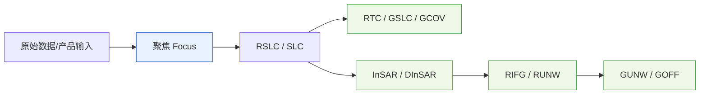
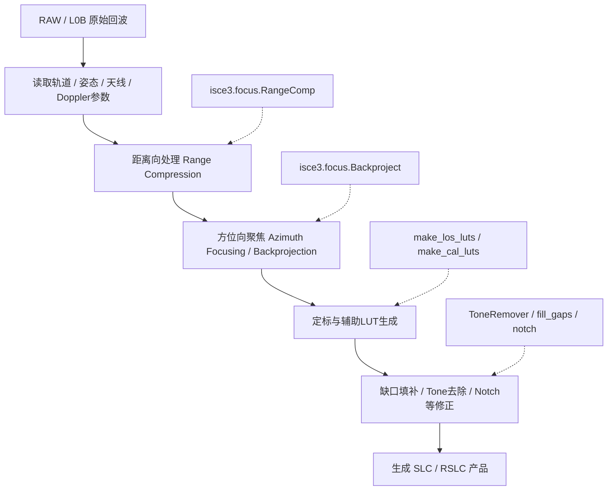
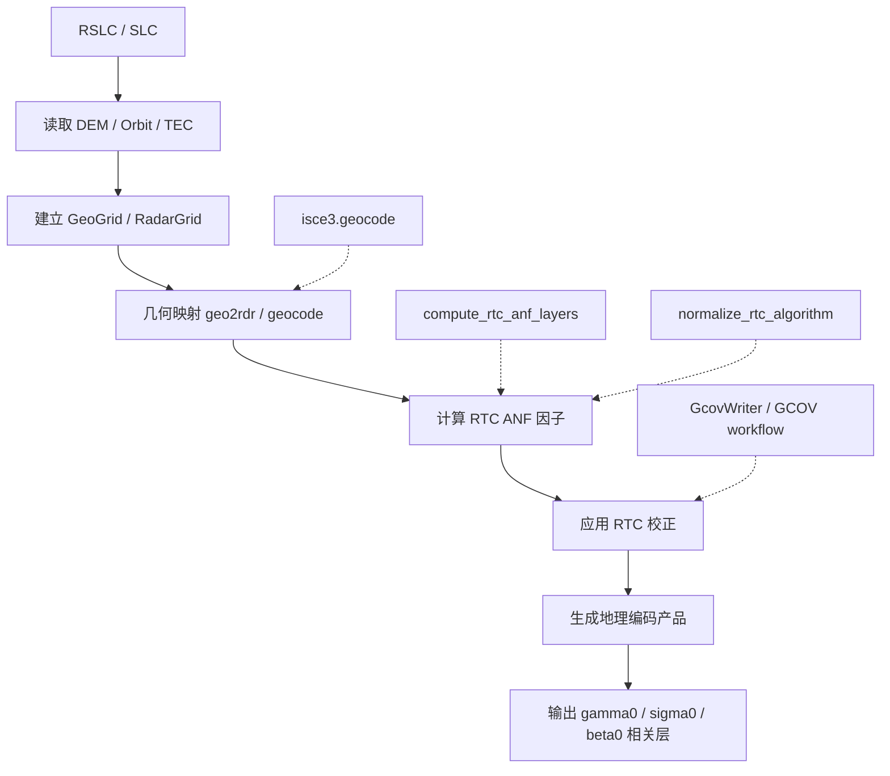
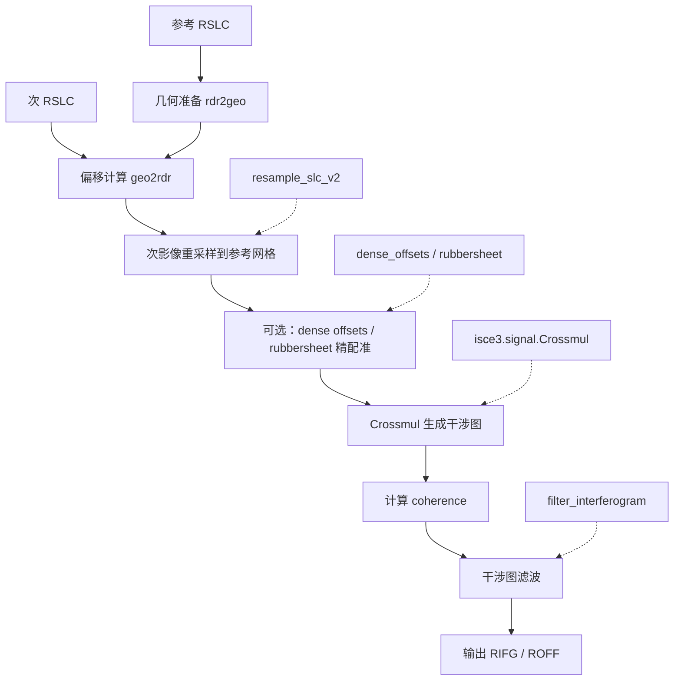
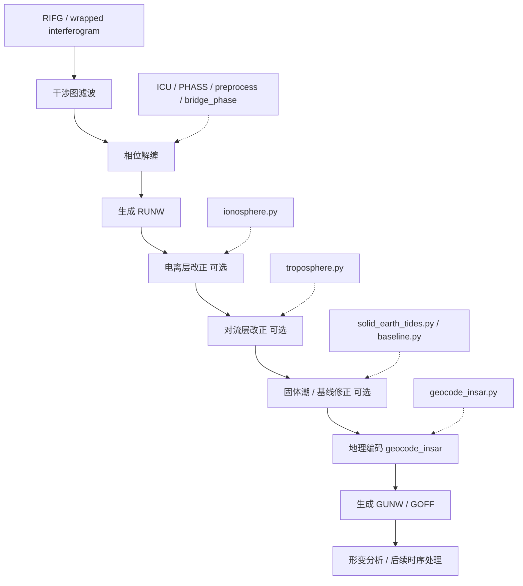
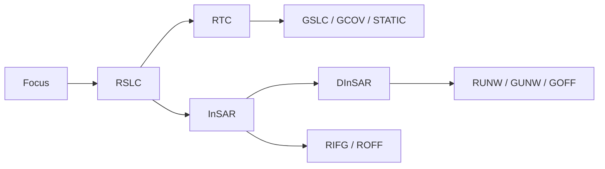

# ISCE3 处理流程参考（聚焦 / RTC / InSAR / DInSAR）

> 用途：作为后续架构设计、应用层编排、模块对接的参考文档。

---

## 1. 总体关系图



---

## 2. 数据聚焦（Focus）流程

### 2.1 目标

把原始 SAR 回波（RAW / L0B）处理成可用于后续成像与干涉的 **SLC / RSLC**。

### 2.2 参考模块

- 工作流：
  - `python/packages/nisar/workflows/focus.py`
- 算法模块：
  - `cxx/isce3/focus/*`
  - `python/packages/isce3/focus/*`

### 2.3 流程图



### 2.4 输入 / 输出

**输入**
- 原始回波数据
- 轨道、姿态、定标参数
- Doppler / chirp / 成像参数

**输出**
- SLC / RSLC
- 辅助定标 LUT
- 几何/定标相关元数据

---

## 3. RTC 流程

### 3.1 目标

对聚焦后的雷达图像进行 **地理编码 + 辐射地形校正**，得到地表后向散射产品与 RTC 因子。

### 3.2 参考模块

- 工作流：
  - `python/packages/nisar/workflows/gcov.py`
  - `python/packages/nisar/workflows/static.py`
- 相关模块：
  - `python/packages/nisar/static/rtc_anf_layers.py`
  - `python/packages/isce3/geometry/rtc.py`
  - `python/packages/nisar/products/writers/GcovWriter.py`

### 3.3 流程图



### 3.4 典型输入 / 输出

**输入**
- RSLC / SLC
- DEM
- Orbit
- GeoGrid 配置
- 可选 TEC / 校正参数

**输出**
- GCOV / GSLC / STATIC 相关产品
- `gamma0_to_beta0_factor`
- `gamma0_to_sigma0_factor`
- 地理编码后 backscatter 层

### 3.5 说明

RTC 本质上是 **几何建模 + geocode + radiometric terrain correction** 的组合流程。

---

## 4. InSAR 流程

### 4.1 目标

从两景已聚焦影像中生成干涉图、相干图、偏移等中间产品。

### 4.2 参考模块

- 主工作流：
  - `python/packages/nisar/workflows/insar.py`
- 子流程：
  - `rdr2geo.py`
  - `geo2rdr.py`
  - `resample_slc_v2.py`
  - `crossmul.py`
  - `filter_interferogram.py`
  - `dense_offsets.py`
  - `baseline.py`

### 4.3 流程图



### 4.4 输入 / 输出

**输入**
- 参考 RSLC
- 次 RSLC
- DEM
- Orbit
- 几何参数

**输出**
- `RIFG`
- `ROFF`
- wrapped interferogram
- coherence
- pixel offsets

---

## 5. DInSAR 流程

### 5.1 目标

在 InSAR 基础上进一步完成 **解缠、改正、地理编码**，获得可用于形变分析的差分干涉结果。

### 5.2 参考模块

- 主工作流：
  - `python/packages/nisar/workflows/insar.py`
- 子流程：
  - `unwrap.py`
  - `ionosphere.py`
  - `troposphere.py`
  - `geocode_insar.py`
  - `solid_earth_tides.py`
  - `baseline.py`

### 5.3 流程图



### 5.4 输入 / 输出

**输入**
- `RIFG`
- coherence / mask
- DEM
- 大气改正数据（可选）
- 几何与轨道参数

**输出**
- `RUNW`
- `GUNW`
- geocoded unwrapped phase
- connected components
- 改正后的形变相关产品

---

## 6. 四条流程之间的关系



可这样理解：

- **Focus**：把原始数据变成可处理影像
- **RTC**：单景地理编码与辐射校正
- **InSAR**：双景干涉与配准
- **DInSAR**：在 InSAR 上增加解缠与差分改正，走向形变产品

---

## 7. 后续工作建议的参考拆分

### A. 数据准备层
- 原始数据 / RSLC / DEM / Orbit / TEC 管理

### B. 基础算法层
- `isce3.focus`
- `isce3.geometry`
- `isce3.image`
- `isce3.signal`
- `isce3.unwrap`
- `isce3.geocode`

### C. 流程编排层
- `focus.py`
- `gcov.py`
- `insar.py`
- `geocode_insar.py`

### D. 产品层
- `RSLC`
- `GCOV / GSLC / STATIC`
- `RIFG / ROFF / RUNW / GUNW / GOFF`

---

## 8. 一句话总结

**ISCE3 的工程结构可以概括为：Focus 负责成像，RTC 负责单景地理与辐射校正，InSAR 负责双景干涉，DInSAR 负责解缠与差分改正，最终生成标准化 NISAR 产品。**

## 9. 面向开发需求的架构分析

这一节不再只是描述 ISCE3 的处理流程，而是把前文的流程理解收敛成一套**面向工程落地的开发判断**。重点不是“ISCE3 能做什么”，而是“我们应该如何围绕它开发”。

### 9.1 基本判断

#### 9.1.1 ISCE3 的定位

从前文与本地仓库可以较稳妥地得出：

- `isce3` 是 **算法库 + 工作流实现集合**；
- 它提供聚焦、几何建模、配准、干涉、解缠、地理编码、RTC 等核心能力；
- 但它不是一个替我们完成第三方数据接入、任务管理、数据治理、可视化交付的一体化应用框架。

因此，在我们的开发语境里，更合理的定位是：

> **把 ISCE3 作为核心算法引擎使用，而不是把它当成完整业务系统。**

#### 9.1.2 `dolphin / plant-isce3 / isce3` 的关系

当前最稳妥的工程策略仍然是：

- 不修改 `isce3`
- 不修改 `dolphin`
- 不修改 `plant-isce3`
- 在外围开发独立 Python 代码、CLI 编排器和交付层

这样做的价值在于：

- 可以持续与 GitHub 上游同步；
- 降低未来升级成本；
- 让算法层与业务层边界清晰；
- 出现问题时更容易定位责任边界。

---

### 9.2 需要纠正的几个容易混淆的点

#### 9.2.1 伪代码是流程说明，不是已确认 API

例如下面这种写法：

```python
master = Raster("master.slc")
slave = Raster("slave.slc")

offsets = ampcor(master, slave)
slave_coreg = resample(slave, offsets)
igram = interferogram(master, slave_coreg)
igram_filt = goldstein(igram)
unw = unwrap(igram_filt)
geo = geocode(unw, dem)
```

它适合表达“处理链条是什么”，但**不能直接当成正式接口定义**。更准确的理解应是：

- 这是说明性伪流程；
- 真正实现时需要绑定到 `isce3.*`、`nisar.workflows.*`、`dolphin` 或 `plant-isce3` 的真实接口；
- 后续开发时要单独定义我们自己的包装接口，而不是把这里的函数名当成产品 API。

#### 9.2.2 `dataset/` 目录结构是建议规范，不是 ISCE3 官方标准

像下面这样的目录：

```text
dataset/
 ├── slc/
 ├── orbit/
 ├── dem/
 └── metadata/
```

很适合作为**我们自己的外部数据组织规范**，但不应表述成“ISCE3 标准内部格式”。

更准确的说法应是：

> **我们建议围绕 ISCE3 定义一套外部数据契约和目录规范。**

#### 9.2.3 “只要有 SLC/orbit/radargrid/doppler 就能跑”过于简化

方向上正确，但工程上不完整。实际上还需要至少补足：

- 坐标系与单位约束；
- 时间参考一致性；
- PRF / DC / sampling 元数据；
- burst / swath / polarization 信息；
- 文件有效性检查；
- 失败恢复与日志输出。

所以真实要求不是“有几个对象就够”，而是：

> **适配层必须产出一组完整、可校验、可编排的数据与元数据包。**

---

### 9.3 建议采用的目标架构

从开发角度，最合理的目标架构不是“大一统应用”，而是四层结构。

#### 第 1 层：算法层

直接复用上游：

- `isce3`
- `dolphin`
- `plant-isce3`

职责：

- 聚焦
- RTC
- 配准
- 干涉图生成
- 解缠
- 地理编码
- 时序分析

#### 第 2 层：适配层

由我们开发。

职责：

- 第三方数据 reader
- metadata 提取与标准化
- orbit 平滑
- DC/PRF 归一化
- 构造 Raster / Orbit / RadarGrid / Doppler / GeoGrid 所需输入
- 形成统一外部数据包

这是整个系统中**最关键的一层**。

#### 第 3 层：编排层

由我们开发。

职责：

- 通过 Python/CLI 调用 `isce3` / `dolphin` / `plant-isce3`
- 控制 focus / rtc / insar / dinsar 执行顺序
- 管理中间文件
- 记录日志、状态、错误
- 支持分步执行与全流程执行

#### 第 4 层：交付层

由我们开发。

职责：

- 结果导出（GeoTIFF / PNG / KML 等）
- Docker 封装
- Web 管理界面
- 结果展示界面
- 任务查询、过程查看、结果下载

---

### 9.4 推荐的开发原则

#### 原则 1：不改上游仓库

这是硬原则。任何业务逻辑优先放在外围仓库中，而不是改 `isce3/dolphin/plant-isce3`。

#### 原则 2：先定义数据契约，再开发 reader

在第三方传感器接入前，必须先定义：

- 输入目录规范
- 必填 metadata
- 中间产物命名
- 核心对象映射关系

否则 reader 会各写各的，后面无法统一编排。

#### 原则 3：先 CLI，后 Docker，再 Web

交付顺序必须是：

1. 先把命令行流程跑通；
2. 再做 Docker 固化环境；
3. 最后再做 Web 界面。

Web 不能反过来定义算法系统架构。

#### 原则 4：先单传感器、单流程 MVP

不要一开始同时支持：

- GF3
- lutan
- tianyi

也不要一开始同时铺开：

- Focus
- RTC
- InSAR
- DInSAR

最合理的方式是先选：

- 一个传感器
- 一条主流程
- 一组最小输出产品

---

### 9.5 对当前需求的开发拆解

基于目前文档，实际开发内容可以拆成以下几类。

#### 9.5.1 第三方数据接口模块

例如：

- GF3
- lutan
- tianyi

主要职责：

- 读原始产品
- 提取 metadata
- 轨道平滑
- DC/PRF 规范化
- 输出标准化输入包

当前实现中，reader / importer 输出的 `manifest.json` 路径语义建议明确为：

- `metadata/*`：相对 `manifest.json` 的相对路径；
- `slc / ancillary / dem`：目录输入时使用绝对路径；ZIP 输入时使用 `{path, storage, member}` 结构；
- 后续处理脚本统一通过路径解析函数恢复成真实路径，而不是假设 `manifest` 中全是绝对路径或 `/vsizip/...` 字符串。

可借鉴部分 `isce2` 实现思路，但不能把 `isce2` 的数据假设整体搬进来。

#### 9.5.2 辅助资源管理模块

例如：

- DEM 下载
- Orbit 下载
- 缓存目录管理
- 文件索引和读取

这部分应该做成**独立辅助模块**，服务所有处理链，而不是绑定某一个 reader。

#### 9.5.3 流程处理模块

至少需要支持：

- 分步执行
- 全流程执行
- 中间结果复用
- 参数配置
- 错误中断与重试

这是你们实际系统的“执行引擎”。

#### 9.5.4 结果转换模块

至少包括：

- GeoTIFF
- PNG
- KML

注意这层应当属于**后处理导出层**，不应驱动核心算法设计。

#### 9.5.5 交付与服务化模块

包括：

- Docker 镜像
- Web 管理界面
- 可视化结果页面
- 任务管理与数据查询

这是后期能力，不应与 reader / 编排器并列作为第一优先级。

---

### 9.6 风险与不确定项

#### 风险 1：第三方数据元数据不完整

如果 reader 拿不到完整的几何与时频参数，那么后续 `isce3` 接口即使能调用，也未必能得到正确结果。

#### 风险 2：把示意流程误当成真实接口

如果后续开发直接按照示意伪代码编码，很容易导致接口设计与真实上游实现脱节。

#### 风险 3：多传感器并行开发导致架构过早复杂化

在 MVP 阶段同时铺开多个传感器，会让适配层、校验层、测试层复杂度显著上升。

#### 风险 4：过早推进 Web 化

如果在 CLI 端到端流程没稳定前就进入 Web 开发，会把算法问题、环境问题、任务编排问题全部带到前端交互层。

---

### 9.7 当前最关键的下一步

从开发顺序上，当前最该推进的不是继续扩写流程图，而是形成三份能指导实现的文档：

1. **外部数据契约草案**
2. **第一阶段 MVP 开发计划**
3. **模块边界与输入输出说明**

其中前两份文档是直接进入开发的基础。

---

### 9.8 小结

如果把这一节收敛成一句话，就是：

> **我们的任务不是“改造 ISCE3”，而是“围绕 ISCE3、dolphin、plant-isce3 构建一个可适配第三方数据、可编排处理流程、可导出结果、可容器化部署的外围系统”。**

为此，必须优先完成：

- 外部数据契约定义
- 单传感器单流程 MVP 设计
- CLI 编排器落地

后续参考文档：

- `ISCE3_外部数据契约草案.md`
- `ISCE3_第一阶段MVP开发计划.md`
